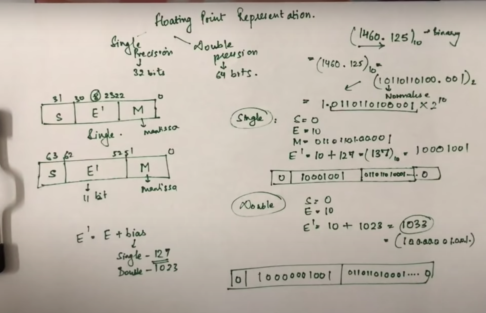
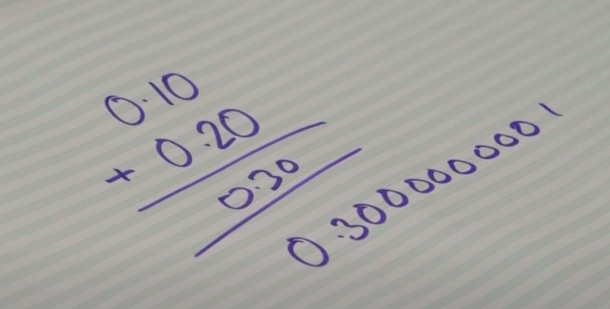
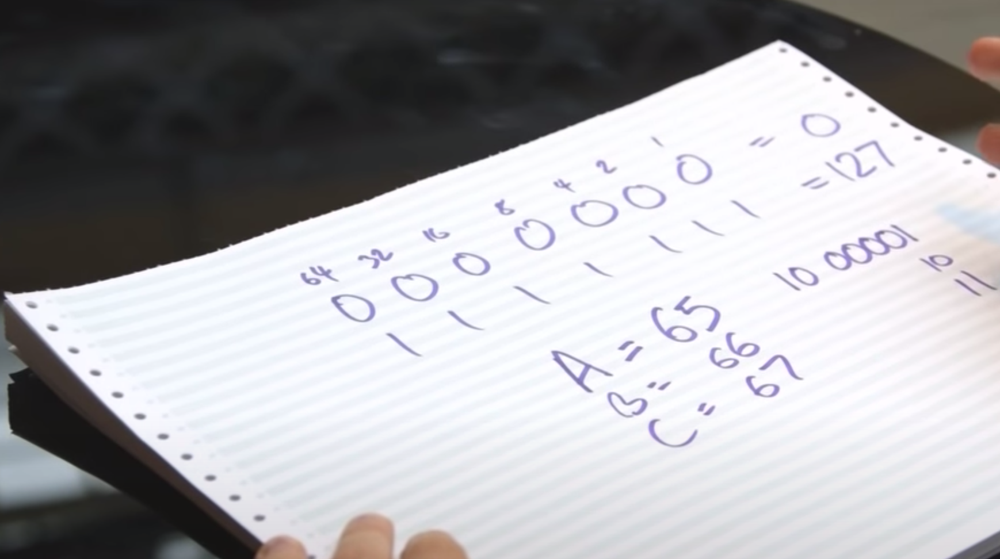
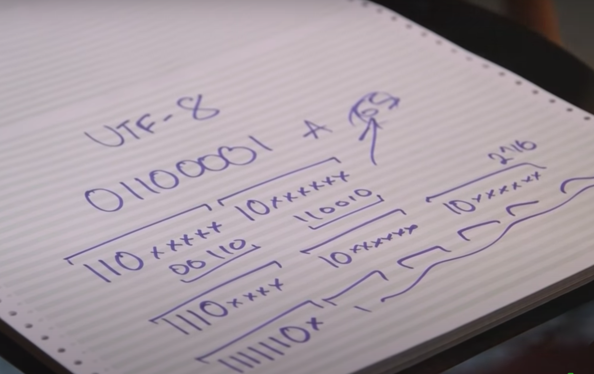
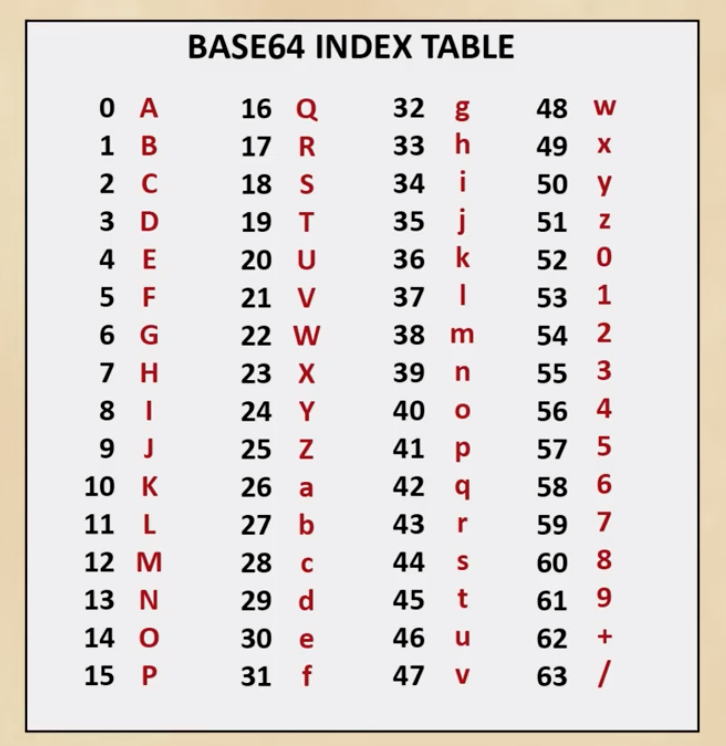
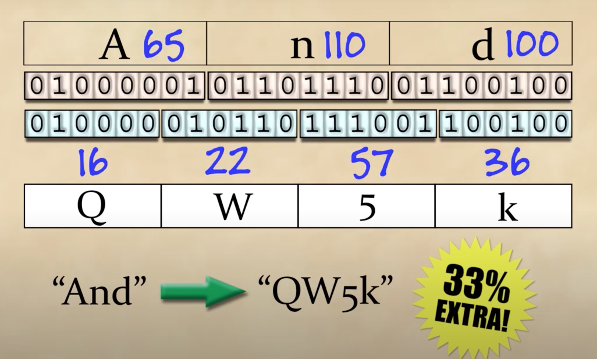
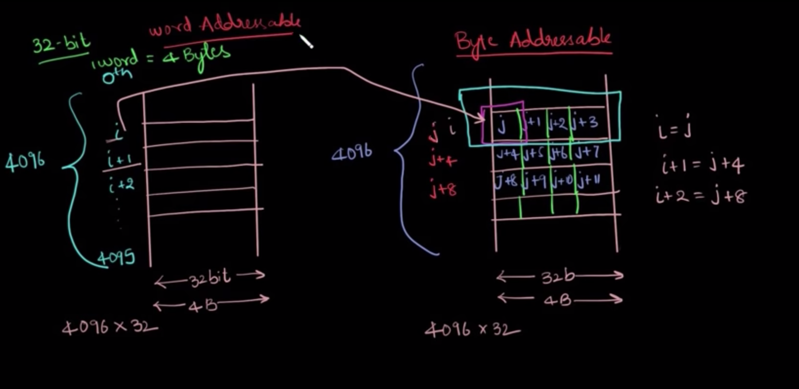
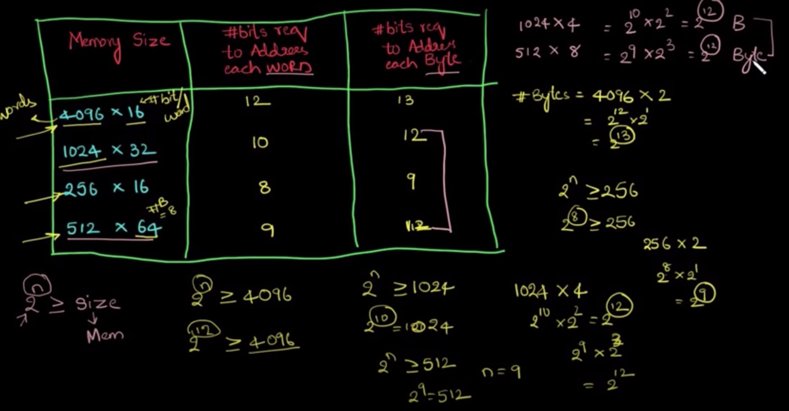

# Number system in Binary
https://www.youtube.com/watch?v=4qH4unVtJkE
## Signed bit
- Simply use first bit as signed it
- It creates negative `0`
- Adding `5` to `-5`, you would expect `0`, but it gives something else
## 1's complement
- It creates negative `0`
- Adding `5` to `-5`, you would expect `0`, it gives negative `0`
- Adding `5` to `-3`, you would expect `2`, it gives `1` with overflow carry `1`
- Adding `6` to `-2`, you would expect `4`, it gives `3` with overflow carry `1`
Observation: If you add `1` to result then it gives real answer

## 2's complement 
- Instead of negative `0`, it will have `-8`
- Adding `5` to `-5`, gives `0`
- When you add each bit of two opposite signed number, it gives `2`, that's why it is called `2's` complement
- Adding `6` to `-2`, would give `4`
- Signed bit represents `-8`
Steps to get `2's` complement
- First take `1's` complement
- Then add `1`
# Hexadecimal number
https://en.wikipedia.org/wiki/Hexadecimal

# Floating number representation
https://www.youtube.com/watch?v=iqMG00tGht0
- There are two standards, `32` bits and `64` bits
- Based on total number of bits, it would be either single precision (32 bits) or double precision (64 bits)


- How to represent currency?
https://www.youtube.com/watch?v=PZRI1IfStY0


# UTF-8
https://www.youtube.com/watch?v=MijmeoH9LT4
## ASCII
- 1960, teleprinter, you type the key, it sends number and same letter come on other side
- But it needs to be standardized, America came up with standard and called it ASCII (7 bit binary system)
- Smartness to choose A = 65

- Your last two digits can tell you what is position of alphabet
- Even smarter to choose lowercase `a` = 97
- Japan started multi byte characters
- Old days, you print out and fax it
## Unicode 
- Then WWW happened
- Setup, unicode consortium
- unicode came up with more than 100k characters
- this covers everything you would possibly writes in any language
- They applied numbers to each character, they didn't choose binary number representation, instead a just pure number
- Web more or less settle down on UTF-8
- They encoded english the exactly as done in ASCII (A is still 65)
Problems with unicode
1. size of word increased as now it has to store 8 bits
2. old system treat 8bits `0` as null

## UTF-8
- Starts with ASCII
- If anything under 128, they can be express as 7 digits, you put `0` and then ascii representation
- If something above 128?
- Two bytes is started with `110`
- Three bytes is started with `1110`
- Four bytes is started with `11110`
- Max it can goes `1111110x`


# Base 32 vs base 62 vs base 64
## Base 64
https://www.youtube.com/watch?v=aUdKd0IFl34
- 6 bits are used for char representation 
- Single `=` or `==` padding is added to match the size





# Byte and Word Addressing
https://www.youtube.com/watch?v=QOrAFDZABsM
- Generally data is stored in `0` or `1`
- 8 bit is called 1 byte
- Group several byte is called one word
- 32 bit machine vs 64 bit machine, this generally denotes the size of the word
- 32 bit, one word equal 4 bytes
- 64 bit, one word equal 8 bytes
- Byte addressable vs Word addressable



# bits-manipulations
# Basics
https://www.hackerearth.com/practice/basic-programming/bit-manipulation/basics-of-bit-manipulation/tutorial/

https://en.wikipedia.org/wiki/Bitwise_operation
## NOT (~)
- Bitwise NOT is an unary operator that flips the bits of the number i.e., if the ith bit is 0, it will change it to 1 and vice versa.
- Bitwise NOT is nothing but simply the one’s complement of a number.
- 
## AND (&)
- x & (-x) to keep the rightmost 1-bit and to set all the others bits to zero
https://leetcode.com/problems/power-of-two/
- a bit-wise AND of n and n−1 flips the least-significant 1-bit in n to 0.
https://leetcode.com/problems/number-of-1-bits/
https://leetcode.com/problems/counting-bits/
https://leetcode.com/problems/hamming-distance/
- to retrieve the right-most bit in an integer n, one could either apply the modulo operation (i.e. n % 2) or the bit AND operation (i.e. n & 1).


## OR (|)
## XOR (^)
### Identity
- XOR of zero and a bit results in that bit
```
0^x=x
```
### Bit negation
- Bit negation
```
1^x=x
```
### Self zero
```
x^x=0
```
### Associativity 
```
(x^y)^z = x ^ (y^z)
```
### Communitivity
```
x^y = y ^ x
```
### Swapping two integer numbers
- Usually when we swap two items, we need to use a temporary variable.
- But if those two items are integers, say x and y, you do not have to.
- You can use XOR as follows.
```
x = x ^ y
y = x ^ y
x = x ^ y
```
- This is based on a simple fact:
```
(A ^ B) ^ A = (A ^ A) ^ B = 0 ^ B = B
```
### Find Odd in Evens
- Given a set of numbers where all elements occur even number of times, except for one number, find that number that only occur odd number of times
- Because of XOR’s properties, including communitivity, associativity and self-zero, if we xor all numbers in the given set, the result will be exactly the odd occuring number!
- XOR of zero and a bit results in that bit
```
    0^x=x
```
- XOR of two equal bits (even if they are zeros) results in a zero
```
    x^x=0
```
- one could see the bit in a bitmask only if it appears odd number of times

https://leetcode.com/problems/single-number/
### Seen once and Seen twice
To separate number that appears once from a number that appears three times let's use two bitmasks instead of one: seen_once and seen_twice.

The idea is to
- change seen_once only if seen_twice is unchanged
- change seen_twice only if seen_once is unchanged


https://leetcode.com/problems/single-number-ii/
https://leetcode.com/problems/single-number-iii/

### Find unique number in array of all duplicate except one
- If we take XOR of zero and some bit, it will return that bit
```
    a^0=a
```
- If we take XOR of two same bits, it will return 0
```
    a^a=0
```
- If we take XOR of three numbers, it will return unique one
```
a^b^a=(a^a)^b=0^b=b    
```
### missing element
https://leetcode.com/problems/missing-number/
```
n ^ (i^nums[i])
```
## LEFT SHIFT (<<)
- Left shift is equivalent as multiplying by 2, as long as your number does not overflow
## RIGHT SHIFT (>>)
- Right shift is equivalent as dividing by 2.
https://leetcode.com/problems/reverse-bits/

## How to check if a given number is a power of 2 ?
```
  bool isPowerOfTwo(int x)
    {
        // x will check if x == 0 and !(x & (x - 1)) will check if x is a power of 2 or not
        return (x && !(x & (x - 1)));
    }
```
## Count the number of ones in the binary representation of the given number
```
    int count_one (int n)
        {
            while( n )
            {
            n = n&(n-1);
               count++;
            }
            return count;
    }
```
- Why this algorithm works ?
- As explained in the previous algorithm, the relationship between the bits of x and x-1
- So as in x-1, the rightmost 1 and bits right to it are flipped, then by performing x&(x-1), and storing it in x, will reduce x to a number containing number of ones(in its binary form) less than the previous state of x, thus increasing the value of count in each iteration.
- 
## Check if the ith bit is set in the binary form of the given number
- Using Left shift operator, we can write 2i as 1 << i . Therefore:
```
 bool check (int N)
    {
        if( N & (1 << i) )
            return true;
        else
            return false;
    }
```
## Max Without Comparison
- With bit operations, we can implement the max operation between two integers a, b without comparisons.
```
int max(int x, int y) {
    int c = a - b;
    int k = (c >> 31) & 0x1;
    int max = a - k * c;
    return max;
}
```
- The purpose of k in the max function is to check if the difference is negative.
# Tricks with Bits
- `x ^ ( x & (x-1))`
    - Returns the rightmost 1 in binary representation of x
    - As explained above, `(x & (x - 1))` will have all the bits equal to the `x` except for the rightmost 1 in `x`
    - So if we do bitwise XOR of `x` and `(x & (x-1))`, it will simply return the rightmost 1
    - x = 10 = (1010)2
    - x & (x-1) = (1010)2 & (1001)2 = (1000)2
    - x ^ (x & (x-1)) = (1010)2 ^ (1000)2 = (0010)2
- `x & (-x)` 
    - Returns the rightmost 1 in binary representation of x
    - (-x) is the two’s complement of x
    - (-x) will be equal to one’s complement of x plus 1
- `x | (1 << n)`
    - Returns the number x with the nth bit set
    - (1 << n) will return a number with only nth bit set
    - So if we OR it with x it will set the nth bit of x

# Bit masking to represent set
https://www.youtube.com/watch?v=7FmL-WpTTJ4

# Leetcode
https://leetcode.com/problems/power-of-three/

https://leetcode.com/problems/power-of-four/

https://leetcode.com/problems/binary-number-with-alternating-bits/

https://leetcode.com/problems/prime-number-of-set-bits-in-binary-representation/

https://leetcode.com/problems/number-of-valid-words-for-each-puzzle/

# Problems
https://medium.com/@codingfreak/bit-manipulation-interview-questions-and-practice-problems-27c0e71412e7

# Reference
https://www.youtube.com/watch?v=xXKL9YBWgCY
