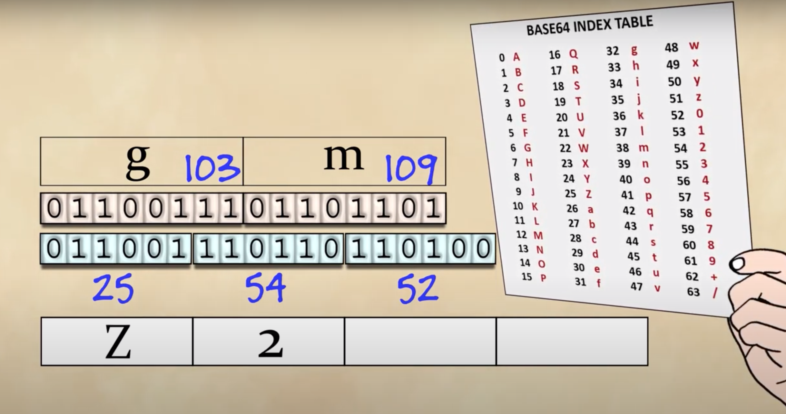

# Signed bit
https://www.youtube.com/watch?v=4qH4unVtJkE
## Simply use first bit as signed it
- It creates negative `0`
- Adding `5` to `-5`, you would expect `0`, but it gives something else
## 1's complement
- It creates negative `0`
- Adding `5` to `-5`, you would expect `0`, it gives negative `0`
- Adding `5` to `-3`, you would expect `2`, it gives `1` with overflow carry `1`
- Adding `6` to `-2`, you would expect `4`, it gives `3` with overflow carry `1`
Observation: If you add `1` to result then it gives real answer

## 2's complement 
- Instead of negative `0`, it will have `-8`
- Adding `5` to `-5`, gives `0`
- When you add each bit of two opposite signed number, it gives `2`, that's why it is called `2's` complement
- Adding `6` to `-2`, would give `4`
- Signed bit represents `-8`
Steps to get `2's` complement
- First take `1's` complement
- Then add `1`
# Hexadecimal number
https://en.wikipedia.org/wiki/Hexadecimal

# Floating number representation
https://www.youtube.com/watch?v=iqMG00tGht0
- There are two standards, `32` bits and `64` bits
- Based on total number of bits, it would be either single precision (32 bits) or double precision (64 bits)

- How to represent currency?

# UTF-8
https://www.youtube.com/watch?v=MijmeoH9LT4
## ASCII
- 1960, teleprinter, you type the key, it sends number and same letter come on other side
- But it needs to be standardized, America came up with standard and called it ASCII (7 bit binary system)
- Smartness to choose A = 65

- Your last two digits can tell you what is position of alphabet
- Even smarter to choose lowercase `a` = 97
- Japan started multi byte characters
- Old days, you print out and fax it
## Unicode 
- Then WWW happened
- Setup, unicode consortium
- unicode came up with more than 100k characters
- this covers everything you would possibly writes in any language
- They applied numbers to each character, they didn't choose binary number representation, instead a just pure number
- Web more or less settle down on UTF-8
- They encoded english the exactly as done in ASCII (A is still 65)
Problems with unicode
1. size of word increased as now it has to store 8 bits
2. old system treat 8bits `0` as null

## UTF-8
https://www.youtube.com/watch?v=MijmeoH9LT4
- Starts with ASCII
- If anything under 128, they can be express as 7 digits, you put `0` and then ascii representation
- If something above 128?
- Two bytes is started with `110`
- Three bytes is started with `1110`
- Four bytes is started with `11110`
- Max it can goes `1111110x`

# Base 32 vs base 62 vs base 64
## Base 64
- 6 bits are used for char representation 
- Single `=` or `==` padding is added to match the size

# Byte and Word Addressing
https://www.youtube.com/watch?v=QOrAFDZABsM
- Generally data is stored in `0` or `1`
- 8 bit is called 1 byte
- Group several byte is called one word
- 32 bit machine vs 64 bit machine, this generally denotes the size of the word
- 32 bit, one word equal 4 bytes
- 64 bit, one word equal 8 bytes
- Byte addressable vs Word addressable

# bits-manipulations
https://www.hackerearth.com/practice/basic-programming/bit-manipulation/basics-of-bit-manipulation/tutorial/
https://en.wikipedia.org/wiki/Bitwise_operation

## NOT (~)
## AND (&)
## OR (|)
## XOR (^)
## LEFT SHIFT (<<)
## RIGHT SHIFT (>>)

# Leetcode
https://leetcode.com/problems/power-of-two/
https://leetcode.com/problems/power-of-three/
https://leetcode.com/problems/power-of-four/
https://leetcode.com/problems/number-of-1-bits/
https://leetcode.com/problems/reverse-bits/
https://leetcode.com/problems/hamming-distance/
https://leetcode.com/problems/counting-bits/
https://leetcode.com/problems/binary-number-with-alternating-bits/
https://leetcode.com/problems/prime-number-of-set-bits-in-binary-representation/

# Problems
https://medium.com/@codingfreak/bit-manipulation-interview-questions-and-practice-problems-27c0e71412e7